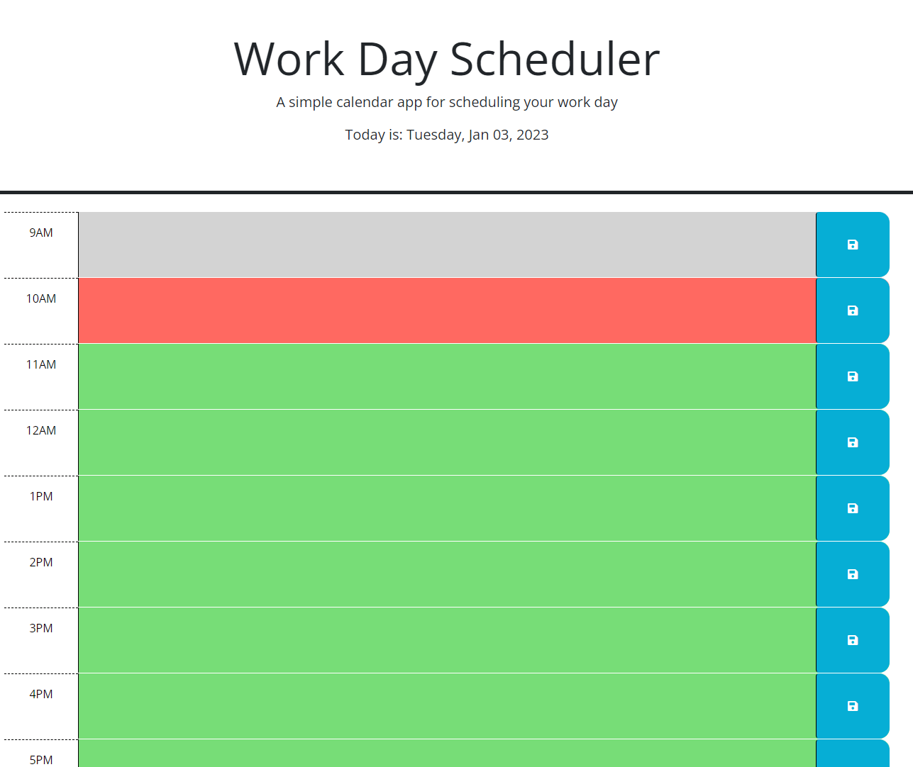
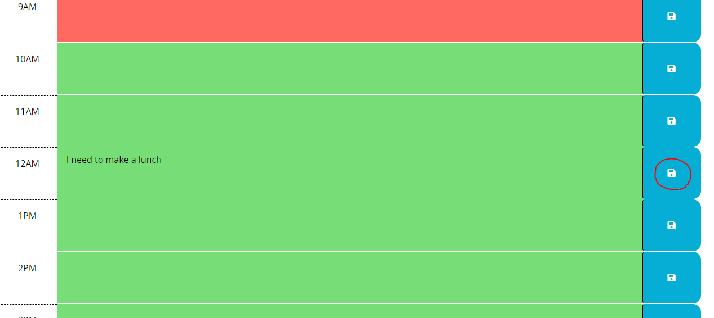
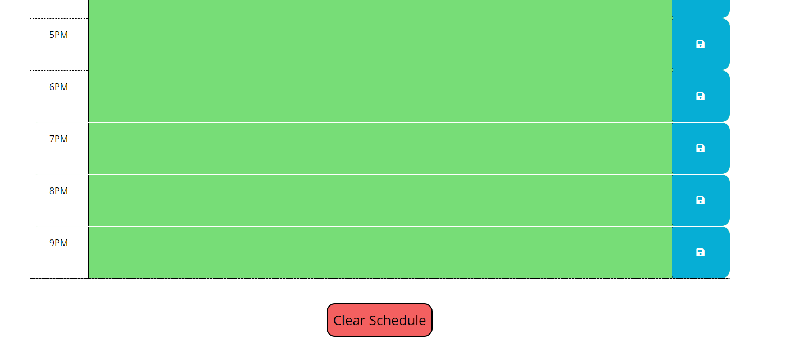

# Work Day Scheduler

## Task for Work Day Scheduler

This challenge is to create a simple calendar application that allows a user to save events for each hour of the day by modifying starter code. This app will run in the browser and feature dynamically updated HTML and CSS powered by jQuery.

## User Story

```md
AS AN employee with a busy schedule
I WANT to add important events to a daily planner
SO THAT I can manage my time effectively
```

## Acceptance Criteria

```md
GIVEN I am using a daily planner to create a schedule
WHEN I open the planner
THEN the current day is displayed at the top of the calendar
WHEN I scroll down
THEN I am presented with timeblocks for standard business hours
WHEN I view the timeblocks for that day
THEN each timeblock is color coded to indicate whether it is in the past, present, or future
WHEN I click into a timeblock
THEN I can enter an event
WHEN I click the save button for that timeblock
THEN the text for that event is saved in local storage
WHEN I refresh the page
THEN the saved events persist
```


## Mock-up

The following animation demonstrates the application functionality:

<!-- @TODO: create ticket to review/update image) -->


## Description

 * A link to deployed application: https://taeyoungp.github.io/WorkDay_Scheduler/

 The following images demonstrate the application functionality:
 

 When the page is opened, user will see today's date and the schedule with time block from 9 AM to 9 PM.
 Past time block has gray color, present time block has red color, and future time block has green color.

 

User can input & modify the events in the time block's text area and can save the content by clicking the save button next to its text area. When the save button is clicked, the button's color will change into green color for 1 second to indicate that content has been saved.

Contents will be saved locally in user's browser and will remain same even when the page is refreshed. 



User can clear the entire schedule by clicking 'clear schedule' button at the bottom of the page.
This will clear all events in the schedule and will erase locally saved data.

When the user hover on 'clear schedule' button, it will change into red color to let user know that they are going to clear the all of the events in the schedule.


## How to use

 * When open up the Work Day Scheduler, the webpage has time schedule from 9 AM to 9 PM.

 * For each of time block, the user can input their schedules and save them by clicking save button. Once save button is clicked, the button will briefly change color to green to indicate that button is clicked and the content in the time block has been saved. 

 * Saved schedules and events will persist even after refreshing the page and will remain same unless the user modify them. 

 * The time block(s) with event(s) that is/are happened will turn into grey color. Time block with current time will red color. The color for future time block(s) has green color. 

 * At the bottom of the schedule time blocks, there is a clear button that allows the user to clear and reset the schedule.


## Credits

> * Code to change background-color for certain amount of time, referenced from: https://stackoverflow.com/questions/3003819/possible-to-change-background-color-onclick-then-automatically-change-back-a-se

> * Code to check if object value is already exist in the array and replace the object, referenced from: https://stackoverflow.com/questions/37585309/replacing-objects-in-array#:~:text=You%20can%20use%20Array%23map%20with%20Array%23find%20.&text=Here%2C%20arr2.,arr1%20i.e.%20obj%20is%20returned. AND https://www.codegrepper.com/tpc/replace+object+in+array+javascript

> * Method for targeting whole elements (currentTarget): https://stackoverflow.com/questions/29168719/can-you-target-an-elements-parent-element-using-event-target 


- - -

© 2022 edX Boot Camps LLC. Confidential and Proprietary. All Rights Reserved.
